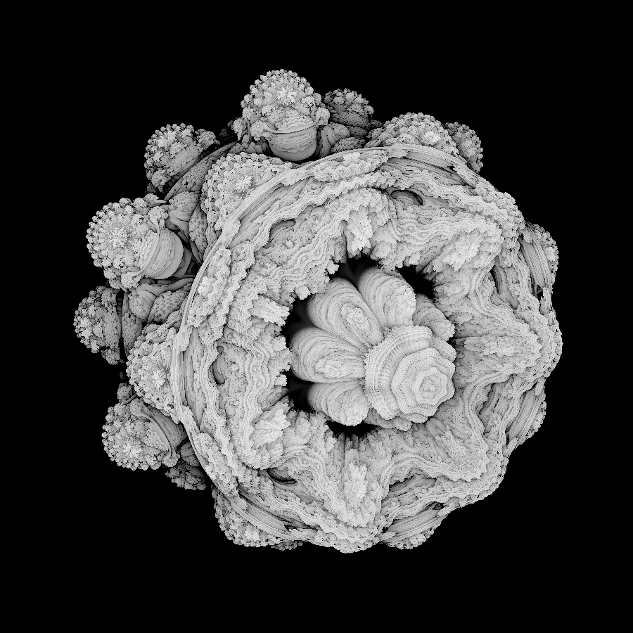
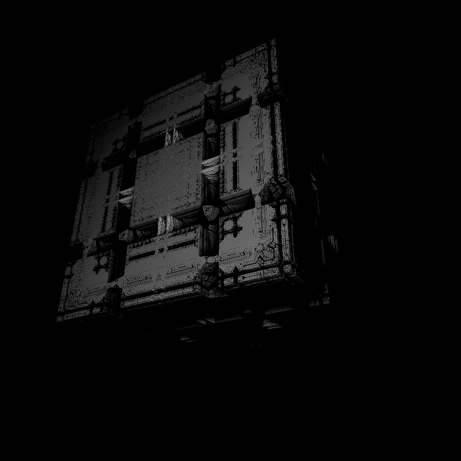

# Mandelbulb Renderer
A Mandelbulb renderer written in C and GLSL. SDL2 and GLAD are used to initialize a window and OpenGL function pointers respectively.
The meat of this renderer is in shaders/fshader.frag

### Controls:
The mouse wheel sets the zoom-rate. It zooms in on where your mouse is.
Press F12 to take a screenshot. Press ESC to exit the renderer.
(The images produced from screenshotting will be flipped.)

## Examples

The Mandelbulb in all of its beauty

Here is the Mandelbox, lurking in the dark

## References / Inspired By
The incredible blog posts [Distance Estimated Fractals](https://blog.hvidtfeldts.net/index.php/2011/06/distance-estimated-3d-fractals-part-i/)

